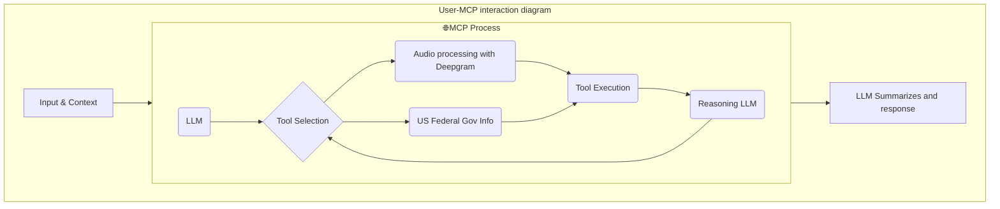

# About

This project shows how to use Strands Agents to get things done with a variety of MCPs



Thanks for writing the docs Claude.ai!

# Prerequisites

-   `ffmpeg`: this project uses it for audio workflows
-   ~~`libportaudio2` (with `apt`) `portaudio-devel` (with `dnf`) or `portaudio` (with `brew`): The Pyaudio package~~
-   `uv`: Python package manager

## Agents

### Audio Processing (`src/agents/audioprocess.py`)

Records a live radio stream and transcribes it using Deepgram, with speaker diarization.

**How it works:**

1. Loads station URLs from `radio_stations.yaml` (organized by type: `talk_radio`, `music`)
2. Records N seconds of a stream to an `.mp3` file via `ffmpeg`
3. Passes the recording to a Strands Agent equipped with the Deepgram MCP tool, which transcribes the audio and identifies speakers

**Station config** (`src/agents/radio_stations.yaml`):

| Type | Key | Station |
|------|-----|---------|
| `talk_radio` | `npr` | NPR Live |
| `talk_radio` | `kexp` | KEXP |
| `music` | `france_indie` | FIP Radio |
| `music` | `radio_swiss_jazz` | Radio Swiss Jazz |

**Run it:**

```
uv run src/agents/audioprocess.py
```

By default it records 10 seconds of NPR. To use a different station, edit the `main()` call at the bottom of the file (`station_type` and `stream_name` args).


### `.env`

This project uses an `.env` file for API keys.  The content of your `.env` should look like:

```
ANTHROPIC_API_KEY=<api_key>
MISTRAL_API_KEY=<api_key>
DEEPGRAM_API_KEY=<api_key>
DEEPGRAM_DEFAULT_MODEL=<a model tag>
```